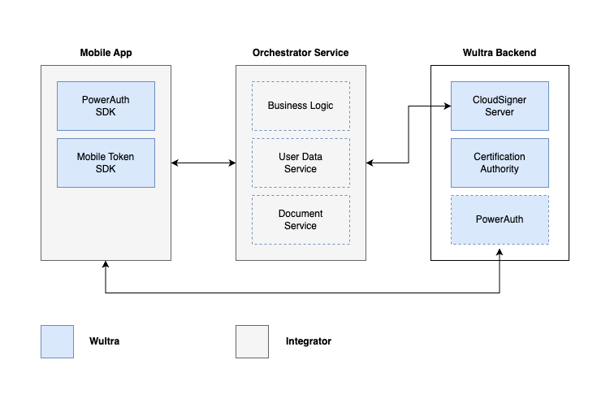

# Architecture

CloudSigner consists of two main backend components: The CloudSigner Server and the Certification Authority (CA). The solution relies on PowerAuth.

Integrators must implement both the mobile application and the orchestrator service. Wultra, however, provides software development kits (SDKs) to help with the integration on mobile application.

## Block Diagram

## Components

**PowerAuth SDK**
Mobile SDK provides cryptography operations support.

**Mobile Token SDK**
Optional SDK will support operation authorization on the device, depending on the usage mode.

**PowerAuth**
PowerAuth solution provides backend device management and works as an SCA provider. The PowerAuth provides public and private API. Public API is consumed directly by PowerAuth SDK. Private API is exposed for integration with other backend services.

**Certification Authority (CA)**
Preconfigured Certification Authority. The authority provides standard certificate enrollment. The authority root certificate can be configured to ensure trust for signed PDFs in the bank (or even by the public). The CA provides REST API for easy integration. Open Source EJBCA is used as a proven and reliable solution. 

**CloudSigner Server**
The component enrolls users and assembles signed PDFs with user certificates. The Signer component works in two basic modes. External Mode utilizes signatures provided by another component (typically PowerAuth). In Cloud Mode, it generates public and private key pairs and creates digital signatures itself.

**Mobile Application**
The mobile application implements the user interface and presentation of documents, as well as signing and approvals. Wultra offers an SDK that simplifies these operations.

**Orchestrator Service**
This is an external service layer that is responsible for coordinating signing operations using the capabilities provided by Wultra components. It also provides user data and serves PDF files for signing.