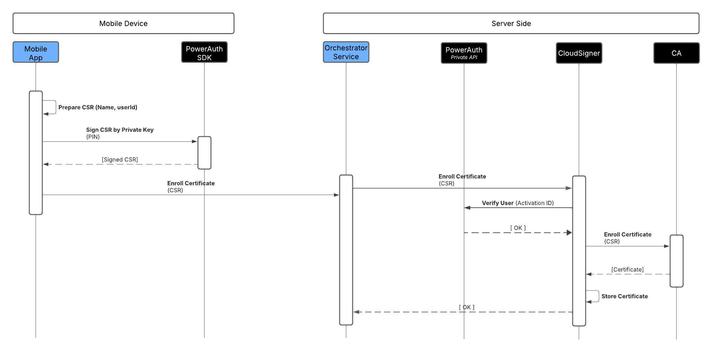
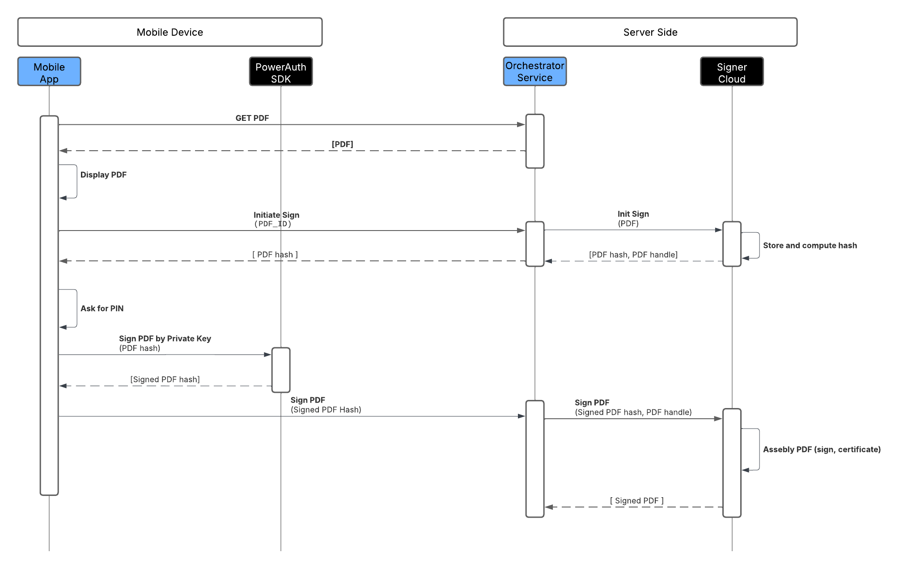

# Integration

## Certificate Enrollment

Steps

1. Prepare the CSR on the mobile device. User data is required, so an external call to the Orchestrator Service may be necessary.
2. Sign the CSR using the PowerAuth SDK on the mobile device.
3. Send the result to the Orchestrator Service (the bank's service that manages business logic).
4. The Orchestrator Service passes the signed CSR to the CloudSigner via the REST API.
5. The CloudSigner will verify the user against PowerAuth, generate the certificate via the CA, and store the certificate for signing. The result is returned immediately.

## Document Signing

Steps

1. Present the document to the user. It needs to be downloaded from the bank's storage, and then let the user select which document should be signed. Then, pass the document (or document ID) from the mobile app to the orchestrator service.
2. Send the document from the Orchestrator Service to CloudSigner via the REST API method "Upload Document." CloudSigner will store the file and return its hash in the response.
3. Use the PowerAuth SDK to sign the document hash on an activated mobile device.
4. Send the result to the Orchestrator Service.
5. Send the signed hash from the Orchestrator Service to CloudSigner via the REST API. After signature verification, the document is complete and the result is returned immediately.

## Application States

Chapter describes application states.

### Signer

States of the entity (user/device) that can sign documents. Some states can be directly controlled via API.

| State   | Description                                                                                                                                            |
|:--------|:-------------------------------------------------------------------------------------------------------------------------------------------------------|
| ACTIVE  | Signer can sign documents. Certificate renewal is active. State can be changed to BLOCKED.                                                             |
| BLOCKED | Signer cannot sign documents, certificate renewal is suspended but certificate stays active until its expiration. State can be changed back to ACTIVE. |
| REMOVED | Signer cannot sign documents, certificate renewal is suspended but certificate stays active until its expiration.                                      |
| REVOKED | Signer cannot sign documents, certificate renewal is suspended and certificate is immediately revoked.                                                 |

### Document

States used during document lifecycle.

| State    | Description                                                                  |
|:---------|:-----------------------------------------------------------------------------|
| WAITING  | Document is uploaded and is waiting for signature. Has configurable timeout. |
| REJECTED | Document was rejected by signer. Has configurable retention period.          |
| SIGNED   | Document is signed. Has configurable retention period.                       |