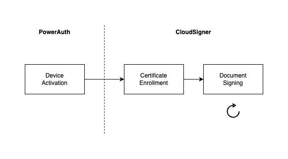
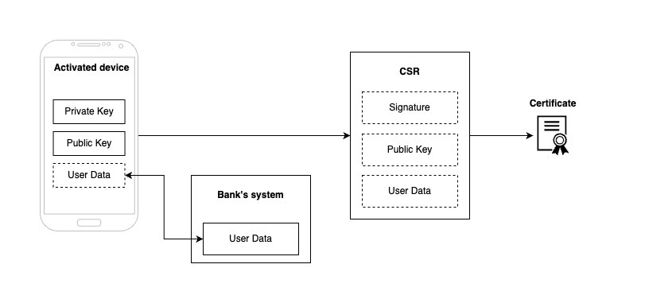
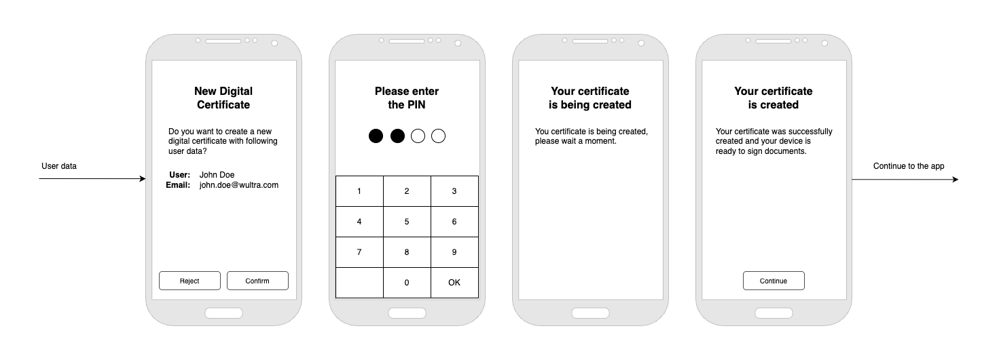
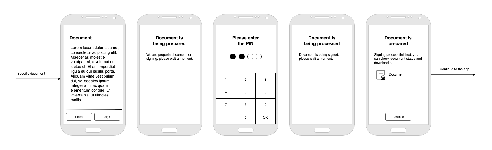
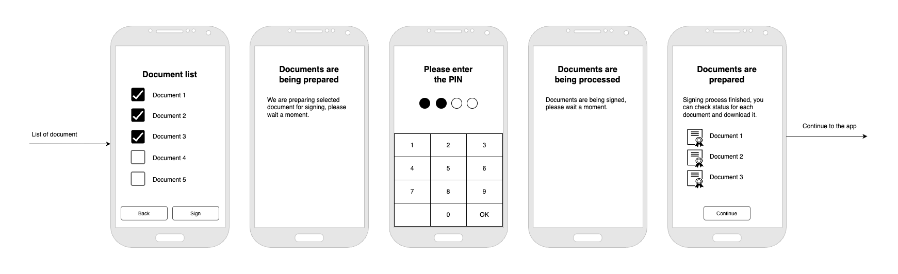

# User Journeys

The schema illustrates the process the user must undergo to sign documents.

**Device Activation**

You can understand this step as prerequisite for using CloudSigner. During the user onboarding, the mobile device is connected to the user’s identity and security keys are generated. These keys are necessary for next phases.

**Certificate Enrollment**

To sign a document you need a certificate and enrollment is the process of generating one. Certificate contains information about specific user and cryptographic data from activated device.

It is basically a combination of user and device certificate but we will call it device certificate, because there can be cases, where the same user has more devices, so the device is clearly identifiable.

**Document Signing**

The signing process involves adding a digital signature, including a certificate from previous step, to a file. Unlike the previous steps, which are one-time actions, signing may be repeated if you have a valid certificate.

## Certificate Enrollment

Certificate is issued by Certification Authority (CA) based on Certificate Signing Request (CSR) which is the file that contains user and cryptography data. So we need to construct this file first (on mobile device).

1. Enrollment is triggered from mobile device.
2. To assembly CSR we need User Data, Public Key and Signature (made using Private Key). App needs to provide missing User Data, the remaining two point are covered by activated device. 
3. CSR is created.
4. CSR is sent from mobile device to the CloudSigner to generate (using Certification Authority) and store certificate.

**User Journey**

**Steps**

1. Start enrollment process and include User Data (it will be included in the certificate). You can start your process right after the activation or later, for example on user’s request.
2. User enters the PIN so app can sign certificate request with device’s private key. In this step, so called CSR file is created. Read more about CSR here.
3. CSR is passed to the CloudSigner and certificate is generated. Process should be quick, so this screen is not strictly necessary.
4. Certificate is created and user is ready to sign documents. Continue to the app or target user directly into your custom flow.

NOTE: If enrollment is placed right after device activation, PIN confirmation from activation can be used. In this case, Step 2 can be omitted.

**Certificate Renewal**

Since certificates have an expiration date (e.g., 3 months, 1 year, 10 years, etc.), you need to create a new certificate before it expires.

The solution does it automatically - it’s tracking certificate validity and starts renewal before the certificate expires. For new certificate, you still need a CSR - we use same CSR generated at the start.

It is also possible to start process again manually - it will just create a new CSR and generate new certificate.

## Document Signing

The signing process involves adding a digital signature to a file. The certificate generated during the enrollment phase is part of this process and will be included in the file.

The solution accepts a PDF file as an input and produces a new PDF with a signature. Although it can only sign one document at a time, you can create a queue to sign multiple documents in the background.

**User Journey**

One document

Multiple documents

**Steps**

1. This step is completely on the application. In general, user should be able to read the document and select what he wants to subscribe. For example, you can also allow signing only if the user opened/read the file.
2. After the confirmation, you need to send PDF files to the CloudSigner. It stores the file and calculates hash.
3. User enters the PIN so app can sign document hash generated in the previous step.
4. Document hash is checked and if everything is OK, we will include user’s certificate into the document stored in step 2.
5. Result is presented to the user so he can download signed document.

## User Management

Once a user is enrolled, they can sign documents. At some point, you may need to temporarily or permanently block some users. This could be due to contract termination, lost or stolen device, application removal or transfer, for example.

In general, we support both temporary and permanent blocks. With others, you can choose to either keep user certificates active until they expire or you can revoke them immediately.

Specific use cases depend on your business and should be considered as valid user journeys.

## Negative scenarios

Keep in mind that a negative scenario can also happen. Every time you call an external API, whether it's yours or Wultra's, a problem could arise (incorrect data sent, network issue, server unavailability, slow response, etc.).

You should be prepared for these cases in the form of loading or error pages. You can also implement retries.